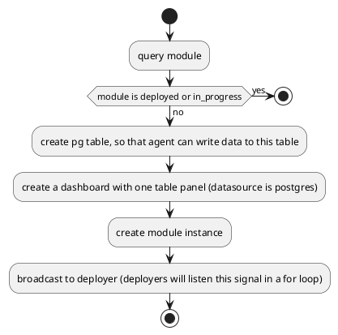

#### Architecture

```plantuml

[starship-cli] -right-> [api-server]: create/list\ndeploy/undeploy\ndelete
[api-server] <-down-> [agent1]: deploy/undeploy\nprocess_info
[api-server] <-down-> [agent2] 
[api-server] <-down-> [agent...] 
[agent1] -left-> [Postgres]: write collect data
[agent1] <-down- [deploy_module_1]: poll data
[agent1] <-down- [deploy_module_2]: poll data
[grafana] -down-> [Postgres]: read
[api-server] -down-> [Postgres]: maintain state

```

#### Data Flow

api-server and agent

```go
// collect process pid and ctime
type ProcessCollector_ReportProcessClient interface {
	Send(*ProcessWrapper) error
	Recv() (*ContainerInfo, error)
	grpc.ClientStream
}

// receive deploy/undeploy command from api-server (api-server -> agent)
// return operation result (agent -> api-server)
type ModuleDeployer_DeployModuleClient interface {
	Send(*DeployModuleResp) error
	Recv() (*DeployModuleReq, error)
	grpc.ClientStream
}
```

agent and eBPF+WASM

```
eBPF -> WASM -> Postgres
```

api-server and starship-cli (or other client)

```
/listModule
/createModule
/deployModule
/undeployModule
/deleteModule
```

#### Usecase

deploy



How `api-server` connect with agent

> the first message is sent from agent, so that `api-server` will have n-goroutine to handle each agent request
> and send requests to agent concurrently

#### Responsibility

- agent
	- send message to api-server, so that api-server know the existence of agent (still have bug? when api-server restart, agent is not able to reconnect)
	- receive (deploy/undeploy/process_info) command from api-server, and execute
	- for each module, init one eBPF+WASM, and poll data from them
	- for each module, convert to json and write to Postgres
- api-server
	- handle create/list/deploy/undeploy/delete command
	- send depoly/undeploy command to agent
	- maintain agent/module_instance state
	- watch pod event (add/update/delete), and request agent for process info
	- create grafana dashboard for each module
- starship-cli
	- easy tool for sending request to api-server
- wasm
	- copy data from ebpf and run wasm function (defined by module json)
- ebpf
	- init probe
	- init perf
	- poll data from perf map

#### State

agent


```go
	// first time connect to api-server
	// agent was offline, but reconnect to api-server with same pod_id (what if pod_id mismatch?)
	AgentState_ONLINE     AgentState = 0
	// when api-server disconnect with agent (error encounter when Recv or Send)
	AgentState_OFFLINE    AgentState = 1
	// agent is online, but with different pod_id
	// pod is deleted
	AgentState_TERMINATED AgentState = 2
```

module instance
```go
const (
	// first time deploy module
	// undeploy module
	ModuleInstanceState_INIT        ModuleInstanceState = 0
	// agent deploy module successfully
	ModuleInstanceState_SUCCEEDED   ModuleInstanceState = 1
	// error occur when agent deploy module 
	ModuleInstanceState_FAILED      ModuleInstanceState = 2
	// module deploy request is sent to agent but not yet successfully deploy
	ModuleInstanceState_IN_PROGRESS ModuleInstanceState = 3
)
```

#### Concept

```go
// ModuleGORM sqlite gorm storage and response object
type ModuleGORM struct {
	// tag schema https://gorm.io/docs/models.html#Fields-Tags
	ID                 string `gorm:"column:id;primaryKey" json:"id,omitempty"`
	Name               string `gorm:"column:name" json:"name,omitempty"`
	DesireState        int    `gorm:"column:desire_state" json:"desire_state,omitempty"`
	CreateTime         string `gorm:"column:create_time" json:"create_time,omitempty"`
	Ebpf               string `gorm:"column:ebpf" json:"ebpf,omitempty"`
	EbpfFmt            int    `gorm:"column:ebpf_fmt" json:"ebpf_fmt,omitempty"`
	EbpfLang           int    `gorm:"column:ebpf_lang" json:"ebpf_lang,omitempty"`
	EbpfPerfBufferName string `gorm:"column:ebpf_perf_name" json:"ebpf_perf_name,omitempty"`
	EbpfProbes         string `gorm:"column:ebpf_probes" json:"ebpf_probes,omitempty"`
	// wasm store the whole wasm file content
	Wasm       []byte `gorm:"column:wasm" json:"wasm,omitempty"`
	SchemaName string `gorm:"column:schema_name" json:"schema_name,omitempty"`
	SchemaAttr string `gorm:"column:schema_attr" json:"schema_attr,omitempty"`
	Fn         string `gorm:"column:fn" json:"fn,omitempty"`
	WasmFmt    int    `gorm:"column:wasm_fmt" json:"wasm_fmt,omitempty"`
	WasmLang   int    `gorm:"column:wasm_lang" json:"wasm_lang,omitempty"`
}


type ModuleInstanceGORM struct {
	// tag schema https://gorm.io/docs/models.html#Fields-Tags
	ID             string     `gorm:"column:id;primaryKey" json:"id,omitempty"`
	// point to a ModuleGROM
	ModuleID       string     `gorm:"column:module_id" json:"module_id,omitempty"`
	ModuleName     string     `gorm:"column:module_name" json:"module_name,omitempty"`
	NodeName       string     `gorm:"column:node_name" json:"node_name,omitempty"`
	AgentID        string     `gorm:"column:agent_id" json:"agent_id,omitempty"`
	State          int        `gorm:"column:state" json:"state,omitempty"`
	DesireState    int        `gorm:"column:desire_state" json:"desire_state,omitempty"`
	CreateTime     *time.Time `gorm:"column:create_time" json:"create_time,omitempty"`
	LastUpdateTime *time.Time `gorm:"column:last_update_time" json:"last_update_time,omitempty"`
}
```


```go
type NodeAgentGORM struct {
	// tag schema https://gorm.io/docs/models.html#Fields-Tags
	AgentID        string     `gorm:"column:agent_id;primaryKey" json:"agent_id,omitempty"`
	NodeName       string     `gorm:"column:node_name" json:"node_name,omitempty"`
	AgentPodID     string     `gorm:"column:agent_pod_id" json:"agent_pod_id,omitempty"`
	State          int        `gorm:"column:state" json:"state,omitempty"`
	CreateTime     *time.Time `gorm:"column:create_time" json:"create_time,omitempty"`
	LastUpdateTime *time.Time `gorm:"column:last_update_time" json:"last_update_time,omitempty"`
}
```

- `Module` describe the detail of using eBPF + WASM
- `ModuleInstance` is like a `task`, describe the current state of running `module`, if `task` is not in desire state, we need to push the state to desire state
- `NodeAgent` describe the real agent process state and its info


### Component Relationship

- 1 `Deployer` (also called `Agent`)
	- n `Module`
		- 1 ebpf program
			- 1 code (from xxx.bcc)
			- 1 perf buffer (even though its type is slice)
				- k cpu
				- register callback function to retrieve data (when call `perf_reader_poll`)
			- k probes (defined by module.json)
		- 1 wasm module
			- 1 code (from xxx.wasm, xxx.wasm can be generated with c code)


### CGO

`bpf_open_perf_buffer`: write events to user space
``
